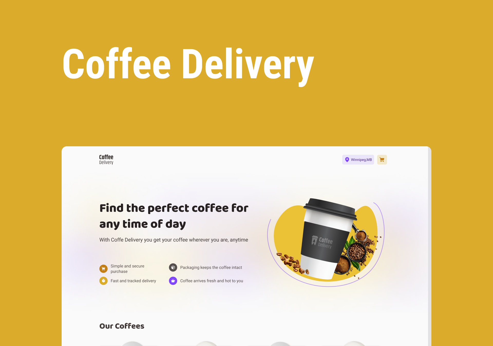

<div align='center'>
        
</div>

<h1 align='center'>
    Coffee Delivery
</h1>


 # 💻 Project
 
A ecommerce app based on a coffee delivery service. Buy your own coffee from anywhere. You can add coffees at the cart and purchase chosing your way to do the payment.
 
 # 🧩 Features
 - List of products (coffee) available for purchase
- Add specific amount of items to cart
- Increase or remove the quantity of items in the cart
- Address form for user fill with your address
- Display total items in cart in Header
- Display the total value of the sum of items in the cart multiplied by the value

 # 🧪 Technologies

This project was developed using the following technologies:
- [ReactJS](https://pt-br.reactjs.org/);
- [ViteJS](https://vitejs.dev/);
- [Typescript](https://www.typescriptlang.org/);
- [Context API](https://pt-br.reactjs.org/docs/context.html);
- [React Router Dom](https://v5.reactrouter.com/web/guides/quick-start);
- [React Hook Form](https://react-hook-form.com/);
- [React Toastify](https://www.npmjs.com/package/react-toastify);
- [Styled Components](https://styled-components.com/);
- [immer](https://github.com/immerjs/immer);
- [Zod](https://github.com/colinhacks/zod);

# 🚀 How to install
Firstly, you will need [NPM 8.15.0](https://www.npmjs.com/) in your machine

Clone this repository and navigate to the project directory
```bash
$ git clone https://github.com/viniokamoto/ignite-timer.git
$ cd ignite-timer
```
Para iniciá-lo, siga os passos abaixo:
```bash
# To install the dependencies
$ npm i

# run the project in develop mode
$ npm run dev
```

After this you need to open your browser on the link provided in the terminal.

# 🎨 Layout
- [Figma](https://www.figma.com/file/z20LsLhlLvhzE0yXWKcO3Y/Coffee-Delivery-(Copy)?node-id=11%3A599)

# 📃 License
[MIT](https://choosealicense.com/licenses/mit/)