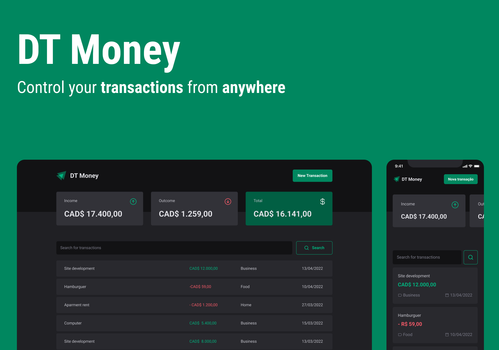

<div align='center'>
        
</div>

<h1 align='center'>
    DT Money
</h1>


 # 💻 Project
 
A expense control to control how much money you have in your wallet. Create your cartegories, add income and outcome entries and search filter them.
 
 # 🧩 Features
 - List of transactions created
- Add transaction 
- Modal for create a new transaction
- Search field for transactions
- Consume API
- Support for small and big devices

 # 🧪 Technologies

This project was developed using the following technologies:
- [ReactJS](https://pt-br.reactjs.org/);
- [ViteJS](https://vitejs.dev/);
- [Typescript](https://www.typescriptlang.org/);
- [Context API](https://pt-br.reactjs.org/docs/context.html);
- [React Router Dom](https://v5.reactrouter.com/web/guides/quick-start);
- [React Hook Form](https://react-hook-form.com/);
- [Styled Components](https://styled-components.com/);
- [Radix](https://github.com/radix-ui);
- [immer](https://github.com/immerjs/immer);
- [Zod](https://github.com/colinhacks/zod);
- [JsonServer](https://github.com/typicode/json-server)

# 🚀 How to install
Firstly, you will need [NPM 8.15.0](https://www.npmjs.com/) in your machine

Clone this repository and navigate to the project directory
```bash
$ git clone https://github.com/viniokamoto/ignite-timer.git
$ cd ignite-timer
```
To start the web app, follow the instructions below:
```bash
# To install the dependencies
$ npm i

# run the project in develop mode
$ npm run dev

# run the json server in develop mode
$ npm run dev:server
```

After this you need to open your browser on the link provided in the terminal.

# 🎨 Layout
- [Figma](https://www.figma.com/file/NLHJDMvtbQFY05NGXWxvPO/DT-Money?node-id=42020%3A2584)

# 📃 License
[MIT](https://choosealicense.com/licenses/mit/)