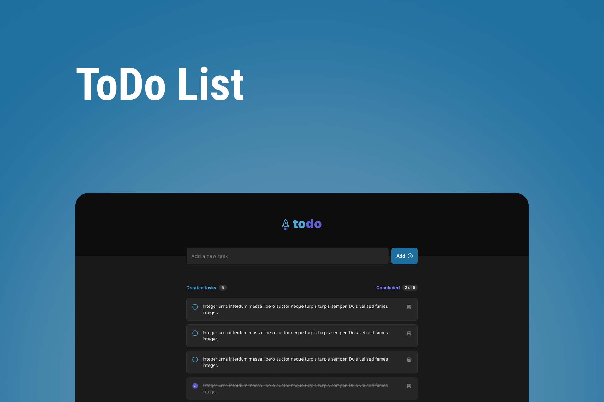
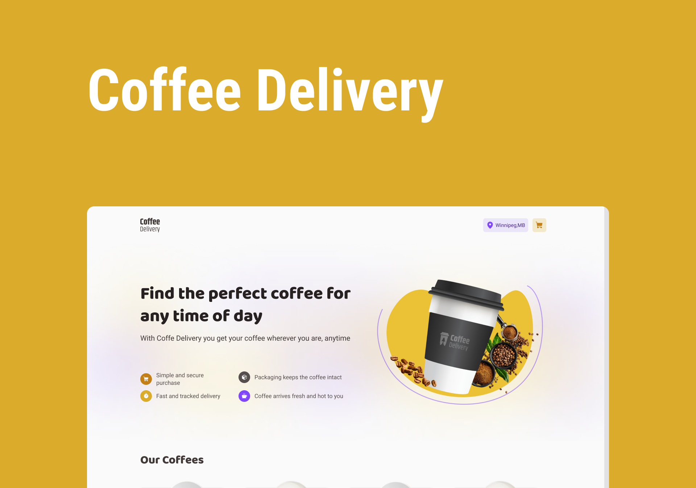
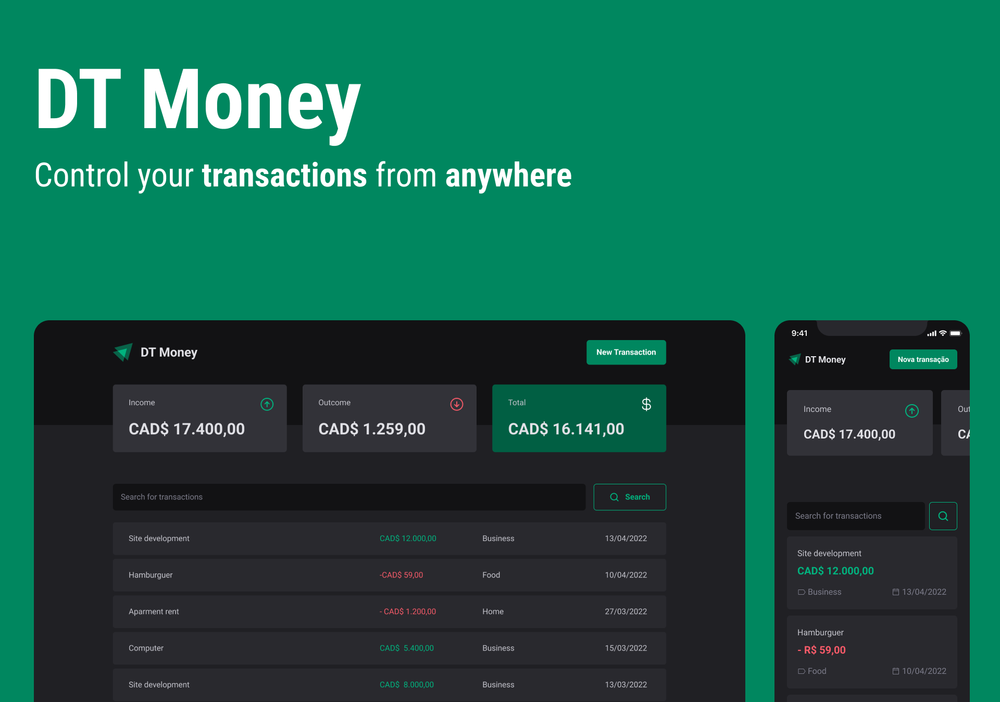

  

  <h2 align="center">Challenges in React TS</h3>

  

    Few challenges and studies around React TS enviroment.
     
  

### Rocket Todo

        

Helpful TODO web application with state control/form/componentization and more! [Source code](https://github.com/ViniOkamoto/challenges-react-ts/tree/master/rocket-todo)

### Coffee Delivery

        

A ecommerce app based on a coffee delivery service. Buy your own coffee from anywhere. You can add coffees at the cart and purchase chosing your way to do the payment.[Source code](https://github.com/ViniOkamoto/challenges-react-ts/tree/master/coffe-delivery)

### DT Money

        

 
A expense control to control how much money you have in your wallet. Create your cartegories, add income and outcome entries and search filter them.[Source code](https://github.com/ViniOkamoto/challenges-react-ts/tree/master/dt-money)

