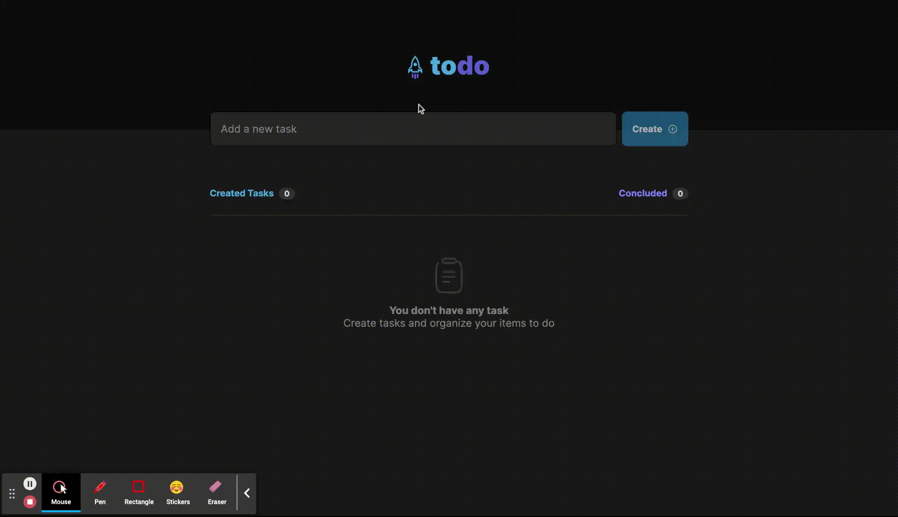

<div align='center'>
        
</div>

<h1 align='center'>
    Rocket Todo
</h1>


 # 💻 Project
 
A simple TODO list which you can create, remove and organize your todos
 
 # 🧩 Features
- Create, Delete and Organize TODOS
- Mobile and Web responsive
- Toast Notifiers

 # 🧪 Technologies

This project was developed using the following technologies:
- [ReactJS](https://pt-br.reactjs.org/);
- [ViteJS](https://vitejs.dev/);
- [Typescript](https://www.typescriptlang.org/);


# 🚀 How to install
Firstly, you will need [NPM 8.15.0](https://www.npmjs.com/) in your machine

Clone this repository and navigate to the project directory
```bash
$ git clone https://github.com/ViniOkamoto/challenges-react-ts.git
$ cd challenges-react-ts/rocket-todo
```
To start the web app, follow the instructions below:
```bash
# To install the dependencies
$ npm i

# run the project in develop mode
$ npm run dev
```

After this you need to open your browser on the link provided in the terminal.

# 🎨 Layout
- [Figma](https://www.figma.com/file/l0qA6YL1znn44rcdrTA1VS/ToDo-List-Challenge?node-id=56%3A964)

# 📃 License
[MIT](https://choosealicense.com/licenses/mit/)