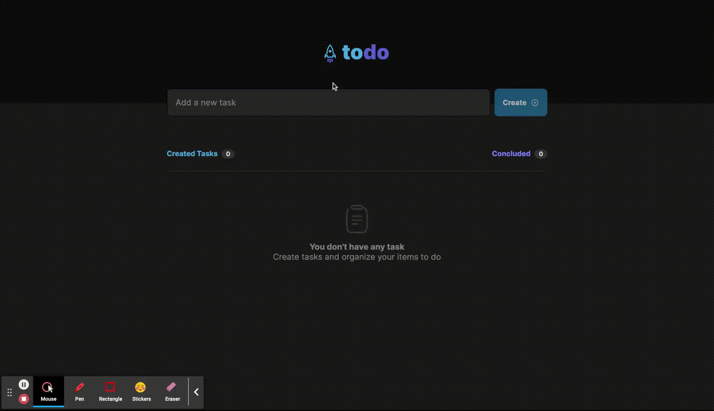

<div align="center">
  <a href="https://github.com/othneildrew/Best-README-Template">
    
  </a>

  <h3 align="center">Rocket Todo</h3>

  <p align="center">
    A simple TODO list for study purposes.
    <br />
  </p>
</div>

## About The Project


## Built With
[![React][React.js]][React-url]
## FIGMA LINK
https://www.figma.com/file/l0qA6YL1znn44rcdrTA1VS/ToDo-List-Challenge?node-id=56%3A96

## Features

- Create, Delete and Organize TODOS
- Mobile and Web responsive
- Toast Notifiers


## Learnings

- Improved css and html knowledge
- Improved knowledge on React Components
- Learning on React state hook
- Learning on package react-toastify
- Learning on manipulation of props
- Improved best practices


## Install

firstly you will need [NPM 8.15.0](https://www.npmjs.com/) in your machine

```bash
  npm install
  npm run dev
```
after this you need your browser on the link provided in the terminal.

[React.js]: https://img.shields.io/badge/React-20232A?style=for-the-badge&logo=react&logoColor=61DAFB
[React-url]: https://reactjs.org/
